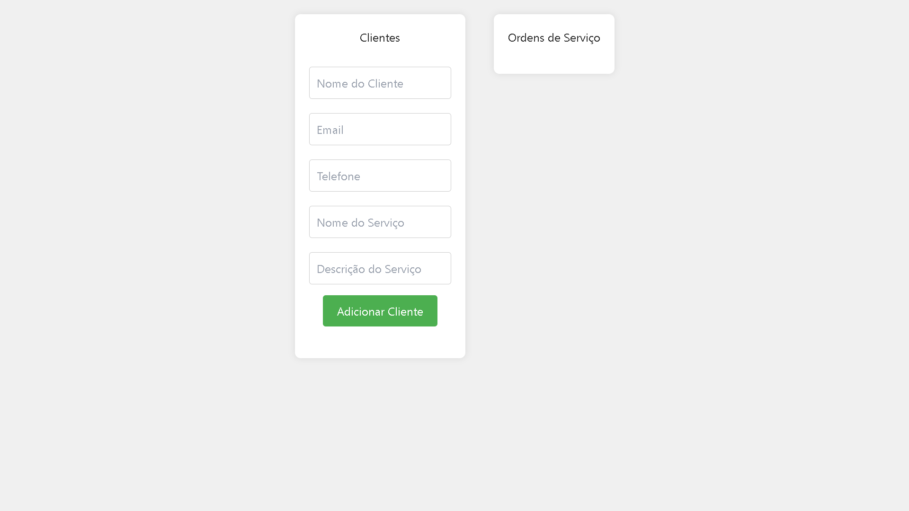
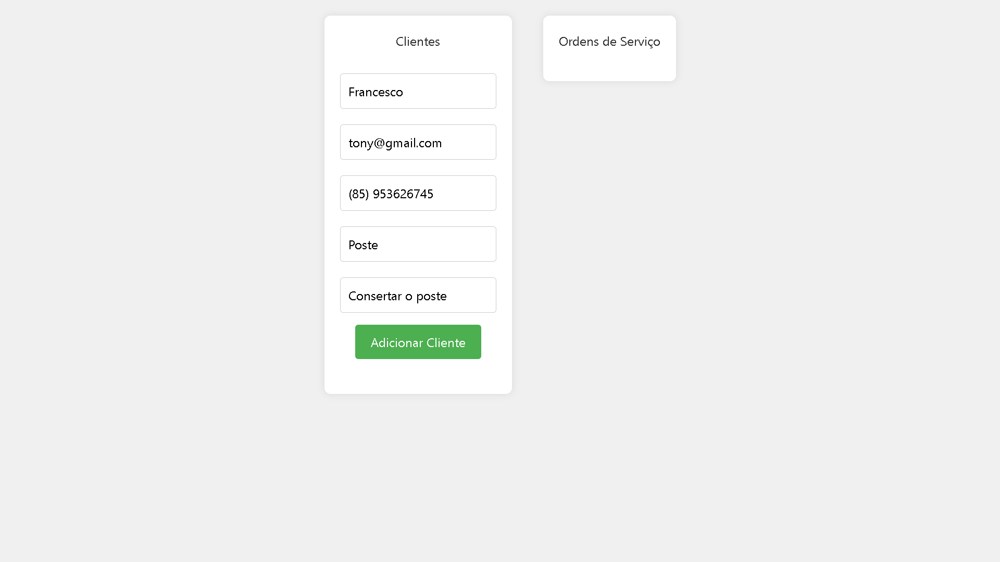
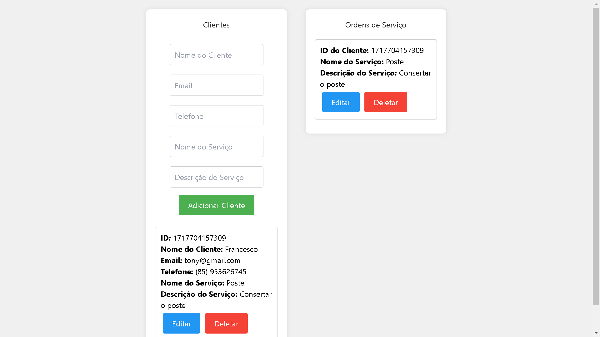

/**
 * Nome do arquivo: README.md
 * Data de criação: 04/06/2024
 * Autor: Francesco Antony
 * Matrícula: 01609346
 *
 * Descrição:
 * Este arquivo JavaScript é responsável por mostrar a leitura geral projeto que criei, com as instalações de depêdencias, as demonstrações que fiz ao decorrer desse projeto.
 *
 * Este script é parte o curso de ADS.
 */

 # **INTRODUÇÃO:**

 Bom, este projeto foi usado o framework chamado Next-js onde o seu servidor é sendo o Node.js onde podemos fazer APIs e requests de forma configurável.
 Até aqui, utilizamos o banco de dados em dicionário em formato json, e o Firebase Deployment, onde primeiro criamos um dicionário que é o sqlite e sqlite3 onde a partir dessa configuração e das importações armazenamos os dados e podemos retornar em resposta em formato json usando o Insommia pelas requests e pelas routes definidas.

 Instale esse framework (Nextjs) com:
 # npx create-next-app@latest

 Depois inicie o servidor com: 
 # npm run dev 
 E use localhost:3000/api/REST-cli/clientes para ver o dicionário. Se quiser inserir outro registro pode manipulá-lo á vontade.
 

 Em relação ao Firebase, fizemos o Deploy na vercel, para conectar ao banco de dados conectando-se usando as variáveis de ambiente definidas:
 
 `FIRE_API_KEY = ''
 FIRE_AUTH_DOMAIN = ''
 FIRE_DATABASE_URL = ''
 FIRE_PROJECT_ID = ''
 FIRE_STORAGE_BUCKET = ''
 FIRE_MESSAGING_SENDER_ID = ''
 FIRE_P_ID = ''
 FIRE_MEASUREMENT_ID = ''`

 Armazene elas dentro de uma .env para consultas.

 
 Antes de tudo, iniciei o framework com essa configuração:
 # npx create-next-app@latest
 De preferência inicie o Windows Power Shell e escolha o seu diretório e as suas configurações.

 # **PROJETO:**

 O meu projeto só envolveu a parte de api (back-end), só que não houve juntamente a parte com front. Apenas fiz uma tabela CRUD em html que envolve dois contêineres: Um 'Clientes' e outro 'Ordens de serviços':

 
Depois faço o registro:
 

Após adicionar cliente e o seu serviço, aparece a lista abaixo na tabela 'Clientes', com as suas informações: Id, nome do cliente, email, entre outros e ao lado ele vincula com a tabela 'Ordens de serviços' pegando o id registrado, com o nome do serviço e a descrição do serviço:
